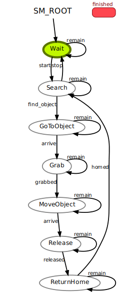

# Управление роботом, заданным в URDF  

### Машина состояний


### Установка зависимостей  

Визуализатор машины состояний:
```bash
sudo apt install ros-noetic-smach-viewer
```

### Подготовка
1. Создать ROS-workspace
```bash  
mkdir -p agrolab_ws/src
```
2. Склонировать текущий репозиторий в папку src внутри workspace:  
```bash  
cd agrolab_ws/src
git clone https://github.com/tamerlan-b/agrolab_robot
cd ..
```
3. Собрать проект:  
```bash  
source /opt/ros/noetic/setup.bash
catkin_make
```

### Запуск RViz с моделью робота
```bash  
source devel/setup.bash
roslaunch agrolab_description display.launch
```

### Запуск узла управления роботом
```bash  
source devel/setup.bash
rosrun agrolab_controller controller_node
```